# 🎯 Euphoric AI - AI Voice Agents Platform

<div align="center">


**Deploy Multilingual AI Voice Agents in 30 Minutes**

[](LICENSE)
[](https://reactjs.org/)
[](https://www.typescriptlang.org/)
[](https://vitejs.dev/)

[🌐 Live Demo](https://euphoricai.io) • [📖 Documentation](https://docs.euphoricai.io) • [🎯 Get Started](https://calendly.com/euphoricai-aivoiceagents-demo/30min)

</div>

---

## ✨ Features

### 🤖 AI Voice Agents
- **Multilingual Support** - 30+ languages with authentic communication
- **Industry-Specific** - Real Estate, Healthcare, Ecommerce specializations
- **24/7 Availability** - Always-on service with 99.9% uptime guarantee
- **Smart Routing** - Qualify leads, route to humans when needed

### 🔐 Authentication & User Management
- **Google OAuth Integration** - Seamless sign-in with Google
- **Secure Registration** - Email/password authentication via Supabase
- **Auto-Redirect Flow** - New users automatically directed to demo booking
- **Session Management** - Persistent user sessions across devices

### 💰 Flexible Pricing
- **Dynamic Billing Toggle** - Switch between monthly/quarterly with 10% savings
- **Three Tier System** - Starter ($299), Standard ($499), Premium ($599)
- **Transparent Pricing** - No hidden fees, Stripe integration
- **Self-Service Setup** - Get started in 30 minutes

### 🎨 Modern UI/UX
- **Responsive Design** - Mobile-first approach with Tailwind CSS
- **Glass Morphism** - Modern glassmorphism design elements
- **Smooth Animations** - Framer Motion for engaging interactions
- **Accessibility** - WCAG compliant design patterns

---

## 🚀 Tech Stack

| Category | Technologies |
|----------|-------------|
| **Frontend** | React 18, TypeScript, Vite |
| **Styling** | Tailwind CSS, Framer Motion |
| **Authentication** | Supabase Auth, Google OAuth |
| **UI Components** | Lucide React Icons, Custom Components |
| **Build Tool** | Vite with Hot Module Replacement |
| **Deployment** | Docker, Nginx, SSL/HTTPS |

---

## 🛠️ Quick Start

### Prerequisites
- Node.js 18+ 
- npm or yarn
- Git

### Installation

1. **Clone the repository**
   ```bash
   git clone https://github.com/euphoricai-2025/Euphoric-AI-Website.git
   cd Euphoric-AI-Website
   ```

2. **Install dependencies**
   ```bash
   npm install
   # or
   yarn install
   ```

3. **Environment Setup**
   ```bash
   cp .env.example .env.local
   # Add your Supabase credentials
   ```

4. **Start development server**
   ```bash
   npm run dev
   # or
   yarn dev
   ```

5. **Open your browser**
   Navigate to `http://localhost:5173`

---

## 🏗️ Project Structure

```
src/
├── components/          # Reusable UI components
│   ├── Header.tsx      # Navigation with auth
│   ├── Footer.tsx      # Footer with social links
│   └── magicui/        # Custom UI components
├── contexts/           # React contexts
│   └── AuthContext.tsx # Authentication state
├── pages/              # Route components
│   ├── Home.tsx        # Landing page
│   ├── Pricing.tsx     # Pricing plans
│   ├── SignIn.tsx      # Sign in form
│   └── SignUp.tsx      # Registration form
├── lib/                # Utilities
│   └── supabase.ts     # Supabase client
└── styles/             # Global styles
```

---

## 🔧 Configuration

### Environment Variables

Create a `.env.local` file with:

```env
VITE_SUPABASE_URL=your_supabase_url
VITE_SUPABASE_ANON_KEY=your_supabase_anon_key
```

### Supabase Setup

1. Create a new Supabase project
2. Enable Google OAuth provider
3. Configure redirect URLs:
   - Development: `http://localhost:5173`
   - Production: `https://yourdomain.com`

---

## 🎯 Key Features Implementation

### Authentication Flow

```mermaid
graph TD
    A[User visits site] --> B{Authenticated?}
    B -->|No| C[Show Get Started → Registration]
    B -->|Yes| D[Show Go to Dashboard]
    C --> E[User signs up]
    E --> F[Auto-redirect to Calendly]
    D --> G[Access Dashboard]
```


### Pricing Toggle
- **Monthly Billing** - Standard rates
- **Quarterly Billing** - 10% discount applied
- **Dynamic Calculation** - Real-time price updates

### User Journey
1. **Landing** → Learn about AI voice agents
2. **Registration** → Sign up with email or Google
3. **Demo Booking** → Automatic Calendly redirect
4. **Dashboard** → Access to AI agent management

---

## 🚀 Deployment

### Docker Deployment

1. **Build the image**
   ```bash
   docker build -t euphoric-ai-website .
   ```

2. **Run the container**
   ```bash
   docker run -p 80:80 euphoric-ai-website
   ```

### Manual Deployment

1. **Build for production**
   ```bash
   npm run build
   ```

2. **Deploy the `dist` folder** to your hosting provider

---

## 🤝 Contributing

We welcome contributions! Here's how to get started:

1. Fork the repository
2. Create a feature branch (`git checkout -b feature/amazing-feature`)
3. Commit your changes (`git commit -m 'Add amazing feature'`)
4. Push to the branch (`git push origin feature/amazing-feature`)
5. Open a Pull Request

### Development Guidelines
- Follow TypeScript best practices
- Use Tailwind CSS for styling
- Maintain responsive design
- Write meaningful commit messages
- Test on multiple devices

---

## 📄 License

This project is licensed under the MIT License - see the [LICENSE](LICENSE) file for details.

---

## 🔗 Links

- **Website**: [https://euphoricai.io](https://euphoricai.io)
- **Dashboard**: [https://app.euphoricai.io](https://app.euphoricai.io)
- **Book Demo**: [Schedule 30min call](https://calendly.com/euphoricai-aivoiceagents-demo/30min)
- **Support**: [support@euphoricai.io](mailto:support@euphoricai.io)

---

## 🙏 Acknowledgments

- **Design Inspiration** - Modern SaaS platforms
- **UI Components** - Tailwind CSS community
- **Icons** - Lucide React
- **Authentication** - Supabase team
- **Animations** - Framer Motion

---

<div align="center">

**Built with ❤️ by the Euphoric AI Team**

[](https://linkedin.com/company/euphoricai)
[](https://instagram.com/euphoricai_official)
[](https://www.facebook.com/profile.php?id=61579584882789)

</div>
